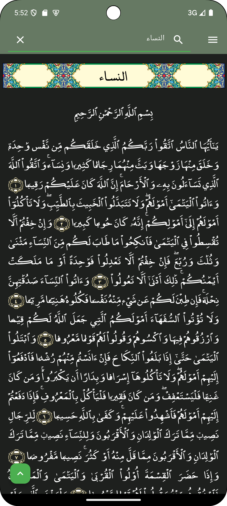
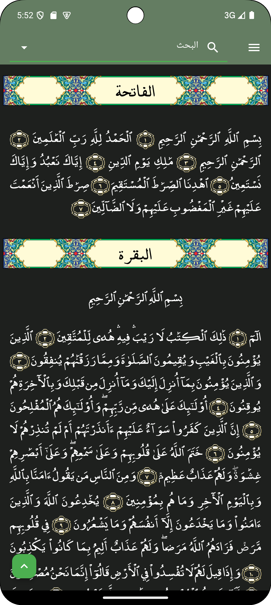
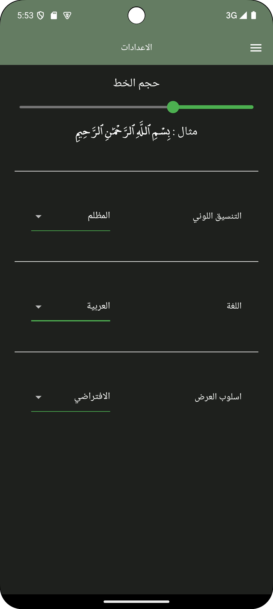
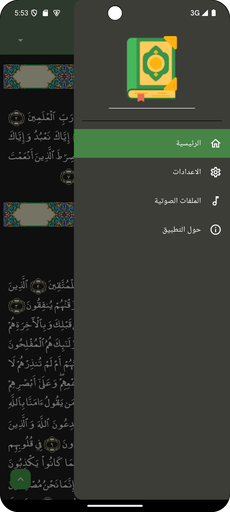
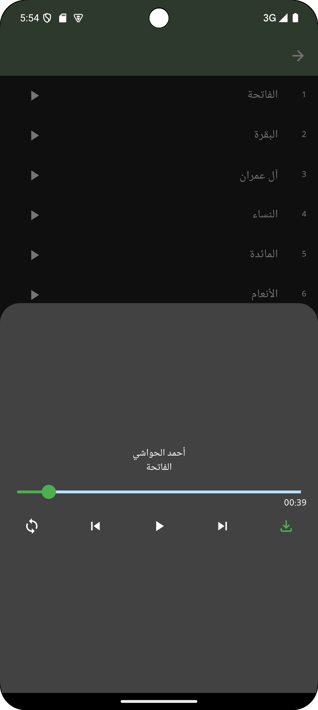
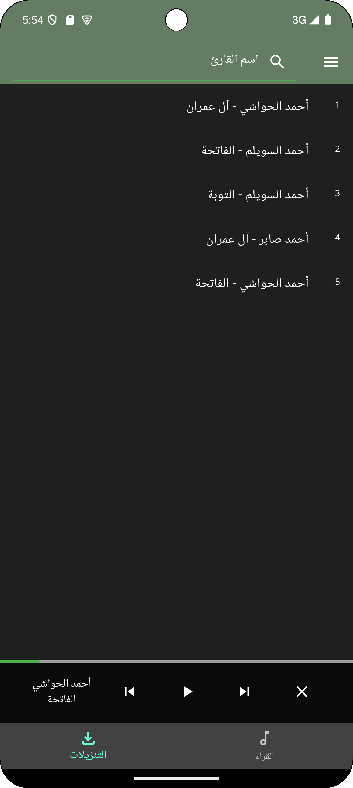

# the holy quran

the holy quran app is aimed to be a contribution to help reading the quran without the need of internet connection and supporting an english transilation of the quran.

you can use this app to read quran in arabic or in english and listen to diffrent readings through the internet or you can download the audio files and listen to them offline.

  
   
  
  
   
  

